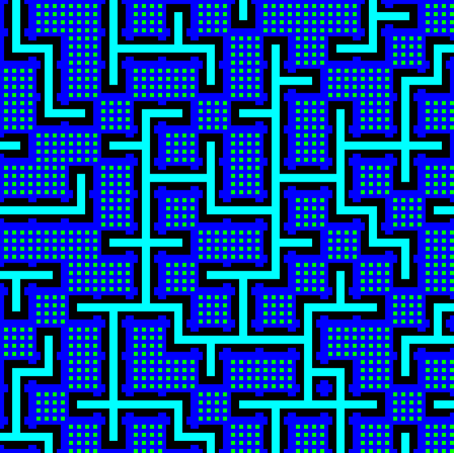
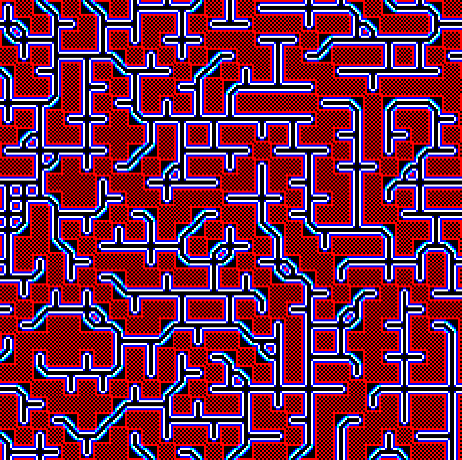
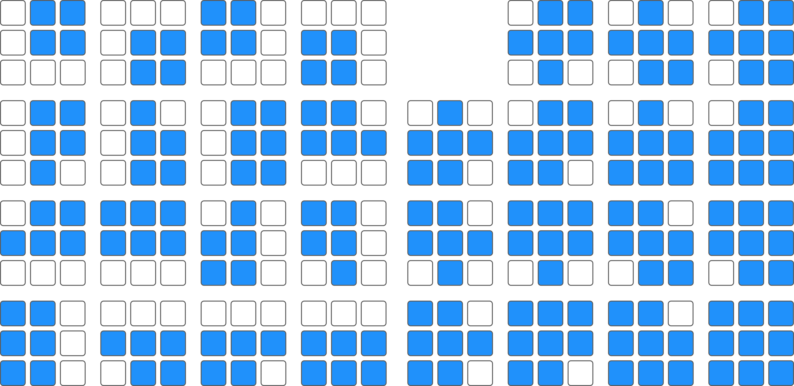

## Box Drawing Characters + Marching Squares = Marching Boxes 

(I'm sure this has been solved before under different names, but it wasn't on Wikipedia so here's short note)

Sebastian Blomfield's ["Lord of the Manor" game](https://www.lordofthemanor.io/) inspired me to explore retro-game engine coding. I'm experimenting in WebGl in the browser. So far, I've got a basic tile-shader that renders [tiled 2D game environments](https://en.wikipedia.org/wiki/Tile-based_video_game) (e.g. [game of life](https://michaelerule.github.io/webgpgpu/games/lesson_11_game_of_life.html), [forest fire simulation](https://michaelerule.github.io/webgpgpu/games/lesson_13_forest_fire.html)). What if I want to draw adjacent tiles of e.g. walls as continuous? 

[Box-drawing characters](https://en.wikipedia.org/wiki/Box-drawing_character) are a nice way to generate rectilinear paths in a tile-based game environment. By looking checking whether the tiles above/below/left/right are also walls, we can select one of 16 box drawing symbols to create nice continuous walls:

Note that this extends the usual unicode box-drawing charaters with five additional tiles: one for an isolated (disconnected) wall, and four for "dead ends". These suffice for rendering square hallways, e.g:

With some tweaks to the style of the box tiles, we can coax box-drawing tiles to generate curvilinear and diagonal paths:

See [here](https://michaelerule.github.io/webgpgpu/games/lesson_12_dendrites.html) for an example page that renders dendriform growth using the above box-drawing tiles (refresh the page to get a new random tile set).

[Marching squares](https://en.wikipedia.org/wiki/Marching_squares) is another nice algorithm for rounding off corners on a map ([e.g.](https://michaelerule.github.io/webgpgpu/games/lesson_15_marching_squares_II.html)), and you can see something like this is used in the maps for classic/retro games. This doesn't quite work out-of-the-box for our tile shader, however, since marching squares accepts the values for the *corners* of each tile. 

Box-drawing tiles are good for lines, and marching squares is good for borders/contours. Can we combine these and get an algorithm that is the best of both worlds, and that renders tiles based on their current value and the values of their neighbors? 

Yes. I'm not sure what the name of this algorithm is. I'm calling it "marching boxes" for now. Marching-boxes extends the box-drawing tiles with 15 new tiles (below). These provide versions of the corner, T-junction, and cross-junction tiles that account for the possibility of nearby filled-in regions. The resulting tiles can render both smooth contours and sharp lines. 

Including a background and foreground tiles, marching boxes uses 48 tiles.

This could be nice for any pattern that has a mixture of lines and enclosed regions, like a dungeon connected by hallways, or a water system that includes both lakes and rivers. 

[Click here to view a WebGL demo of marching-boxes tile rendering](https://michaelerule.github.io/webgpgpu/games/lesson_17_marching_boxes.html)