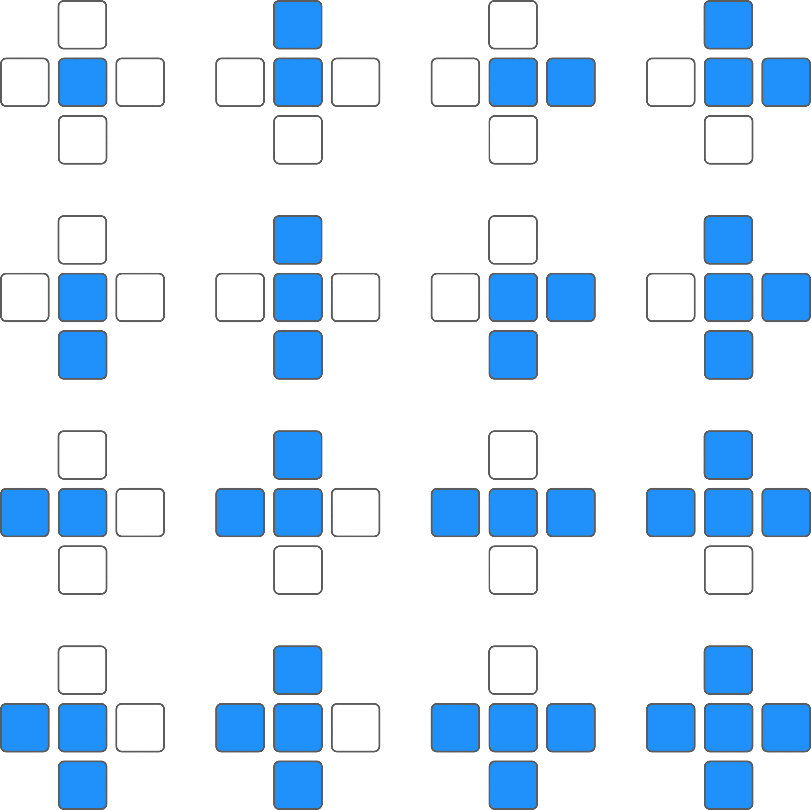
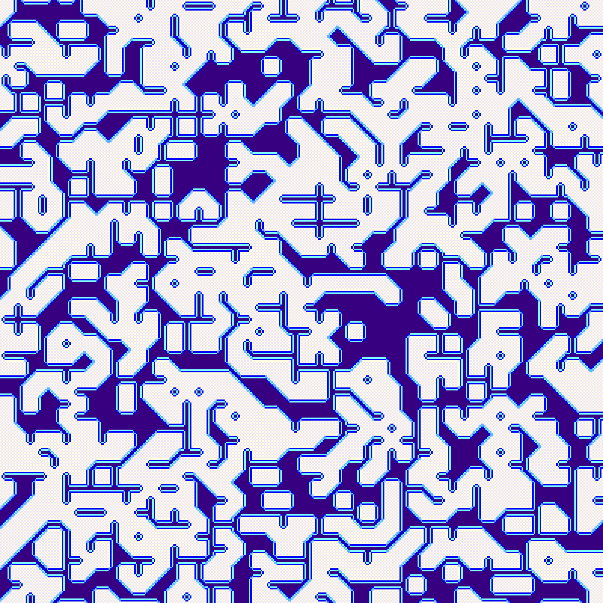
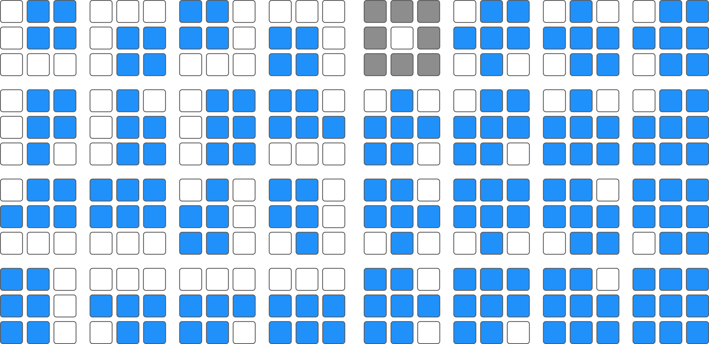

## Marching Boxes 

(I'm sure this has been solved before under different names, but I noticed it wasn't on Wikipedia so I thought I'd write a short note)

Sebastian Blomfield's ["Lord of the Manor" game](https://www.lordofthemanor.io/) inspired me to explore retro-game engine coding. I'm experimenting in WebGl in the browser. So far, I've got a basic tile-shader that renders [tiled 2D game environments](https://en.wikipedia.org/wiki/Tile-based_video_game) (e.g. ). What if I want to draw adjacent tiles of e.g. walls as continuous? 

[Box-drawing characters](https://en.wikipedia.org/wiki/Box-drawing_character) are a nice way to generate rectilinear paths in a tile-based game environment. By looking checking whether the tiles above/below/left/right are also walls, we can select one of 16 box drawing symbols to create nice continuous walls:

Note that this extends the usual unicode box-drawing charaters with five additional tiles: one for an isolated (disconnected) wall, and four for "dead ends". These suffice for rendering square hallways, e.g:

With some tweaks to the style of the box tiles, we can coax box-drawing tiles to generate curvilinear and diagonal paths:

[Marching squares](https://en.wikipedia.org/wiki/Marching_squares) is another nice algorithm for rounding off corners on a map, and you can see something like this is used in the maps for classic/retro games.

Box-drawing tiles are good for lines, like the roads or pipes in Sim City. Marching squares is nice for borders and contours, but it takes as input the *corners* of the tile, as opposed to the tile and its neighborhood. Can we combine these and get the best of both worlds? 

Yes, and I like the results. I'm not sure what the name of this algorithm is, so I'm going to call it "marching boxes" for now. This could be nice for any pattern that has a mixture of lines and enclosed regions, like a dungeon connected by hallways, or a water system that includes both lakes and rivers. 

Marching-boxes tiles extends the box-drawing characters with 16 new tiles. These provide versions of the corner, T-junction, and cross-junction tiles, that account for the possibility of filled in regions on the map. The resulting tiles can render both smooth contours and sharp lines. 

